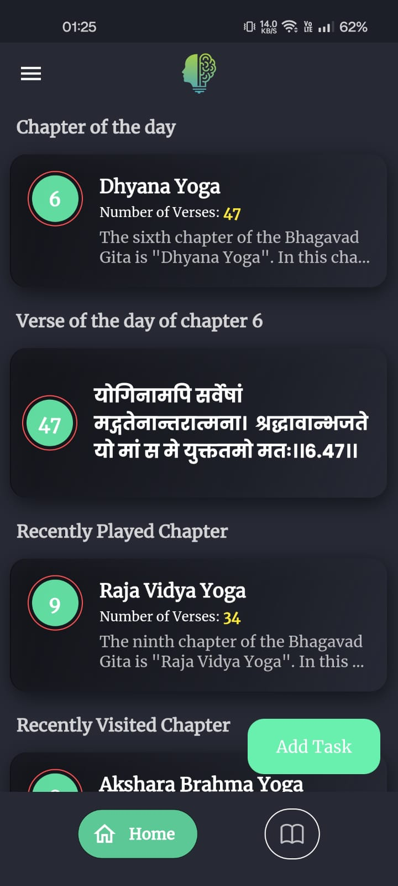
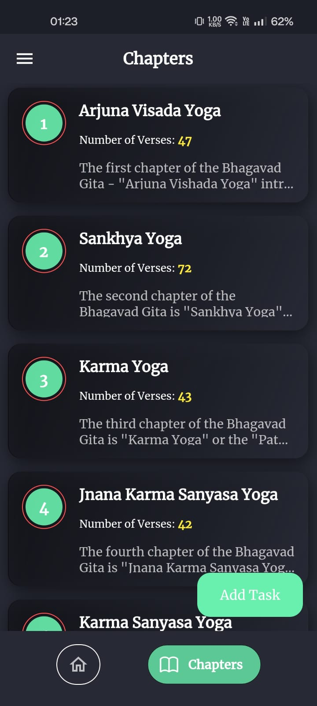
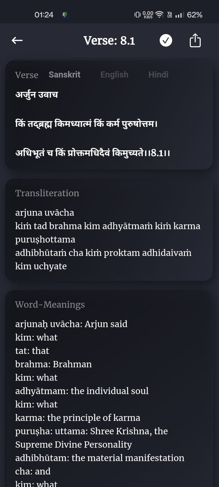
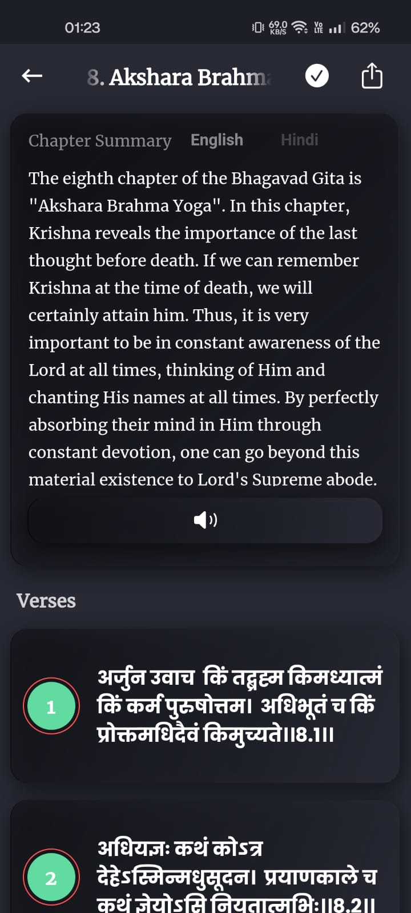
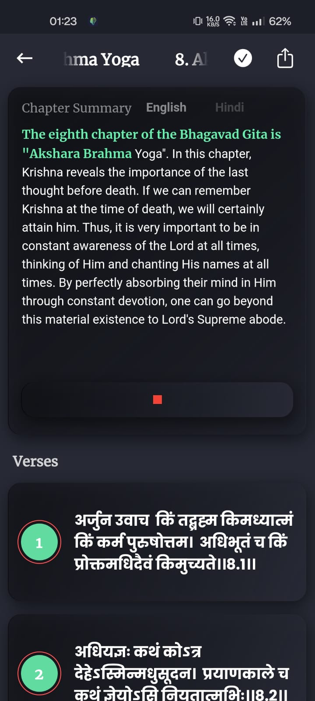
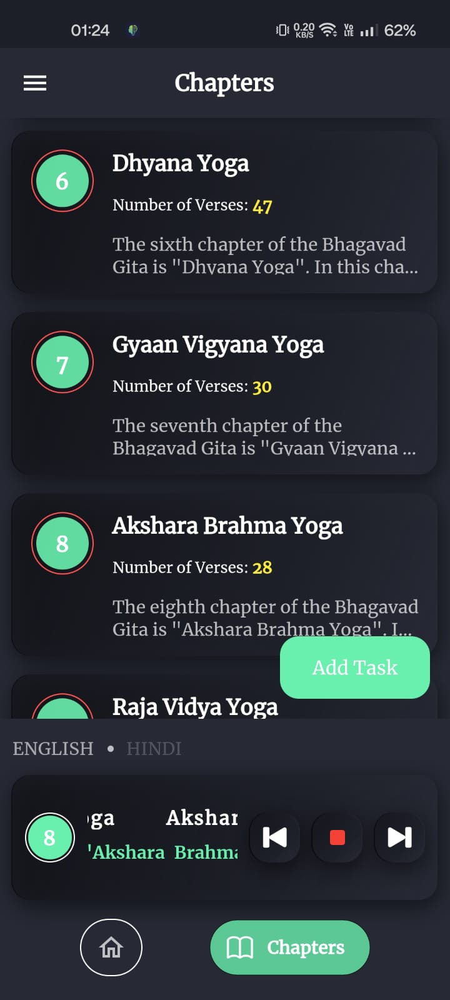
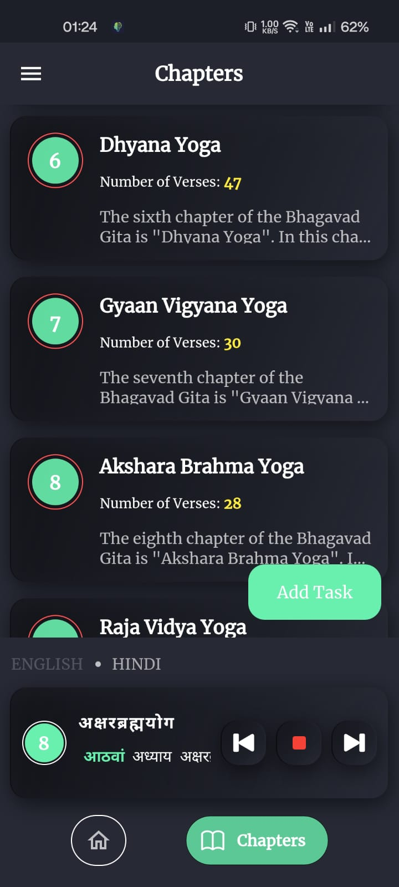
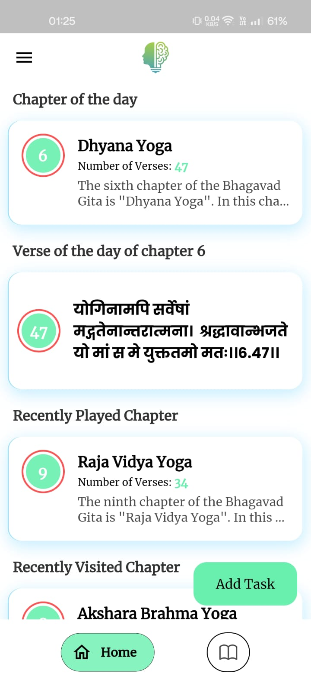

#  Bhagavad Gita App 📖

A modern, immersive Flutter application designed to bring the ancient wisdom of the Bhagavad Gita to your fingertips. This app provides a seamless experience for reading, listening to, and tracking your spiritual journey through the 18 chapters and 700 verses of the Gita.

---

## 🎯 Problem Statement

Many existing Bhagavad Gita apps either lack structured reading progression, 
clear translations, or an engaging user experience. 

This project aims to provide:
- A distraction-free reading experience  
- Structured daily engagement  
- Multi-language accessibility  
- Seamless audio integration  

The goal is to combine spirituality with modern mobile UX design.

---

## 🚀 Features

### 📚 Chapter Overview
Detailed summaries and verse counts for all 18 chapters (e.g., Karma Yoga, Bhakti Yoga).

### 🔍 Verse Exploration
Deep dive into individual verses with:
- Sanskrit text  
- Transliteration  
- Word meanings  
- Translations in English and Hindi  

### 🔊 Audio Integration
Built-in media playback controls to listen to divine recitations.

### 🌅 Daily Wisdom
- "Chapter of the Day"
- "Verse of the Day"  
Stay inspired daily.

### 📈 Progress Tracking
- Recently Played  
- Recently Visited  
Resume your study easily.

### 🔔 Smart Notifications
Customizable alerts for completed verses and chapters to maintain a daily spiritual habit.

### 🎨 Personalization
- Light/Dark modes  
- Multi-language translations  

---

## 🛠 Tech Stack

- **Framework:** Flutter  
- **Language:** Dart  
- **API:** Bhagavad Gita API via RapidAPI  
- **Local Storage:** SharedPreferences (for tracking user progress)  
- **Notifications:** Awesome Notifications (for scheduled reminders)  

---

## 📸 Screenshots

| 🏠 Home | 📖 Chapters |
|--------|-------------|
|  |  |

| 📜 Verse Reading | 📘 Chapter Summary |
|------------------|-------------------|
|  |  |

| 📖 Summary Reading | 🎵 Audio (English) |
|--------------------|-------------------|
|  |  |

| 🎵 Audio (Hindi) | 🌞 Light Mode |
|-----------------|--------------|
|  |  | 

---

## 🧠 Architecture & Design

The application follows a modular and layered structure to ensure scalability and maintainability.

### Structure

- **Presentation Layer** – Flutter UI screens and reusable widgets  
- **Service Layer** – API handling and business logic  
- **Persistence Layer** – Local storage using SharedPreferences  
- **Notification Layer** – Scheduled reminders using Awesome Notifications  

This separation improves:
- Code readability
- Testability
- Future scalability
- Easier feature expansion

---

## 🔌 API Integration

The app integrates with the Bhagavad Gita API via RapidAPI to fetch:

- All 18 chapters
- Verse-level details
- Translations (English & Hindi)
- Word meanings

### Key Implementation Details

- Asynchronous API calls using Future-based architecture  
- Error handling for network failures  
- Optimized data parsing  
- Minimal redundant API requests  

---

## 📊 State Management & Performance

The application efficiently manages asynchronous updates using:

- FutureBuilder for network-bound UI rendering  
- Optimized widget rebuild strategies  
- Lazy data loading for verse content  

Performance Optimizations:

- Reduced unnecessary rebuilds  
- Compressed image assets  
- Controlled API invocation frequency  

This ensures smooth scrolling and fast loading times even on low-end devices.

---

## 💾 Data Persistence

User progress is stored locally using SharedPreferences.

Tracked Data:
- Recently visited chapters  
- Recently played audio  
- Daily engagement tracking  

This allows users to resume their spiritual journey seamlessly.

---

## 🔔 Smart Notification System

The app uses Awesome Notifications to:

- Schedule daily reminders  
- Encourage consistent reading habits  
- Notify completion milestones  

Users can customize or disable notifications from the settings screen.

---

## 🚀 Future Improvements

Planned Enhancements:

- Bookmark & Favorites system  
- Advanced search filters  
- Cloud sync with user accounts  
- Analytics dashboard for reading habits  
- Play Store deployment  

The long-term vision is to transform this into a complete spiritual learning platform.

---

## 👨‍💻 Author

Developed by **Rupam Karmakar**

Flutter Developer | Product Builder | Technology Enthusiast
